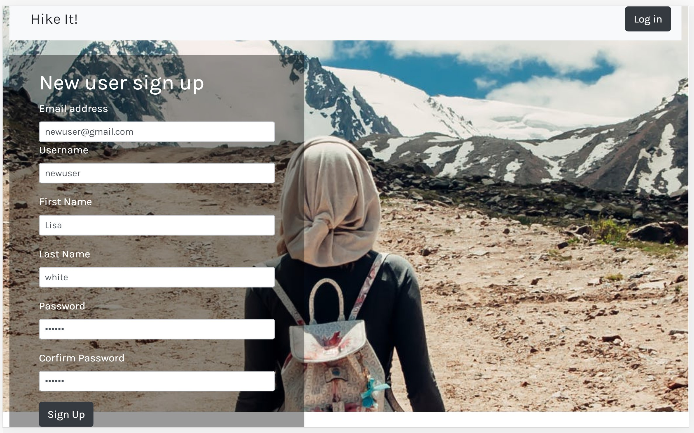
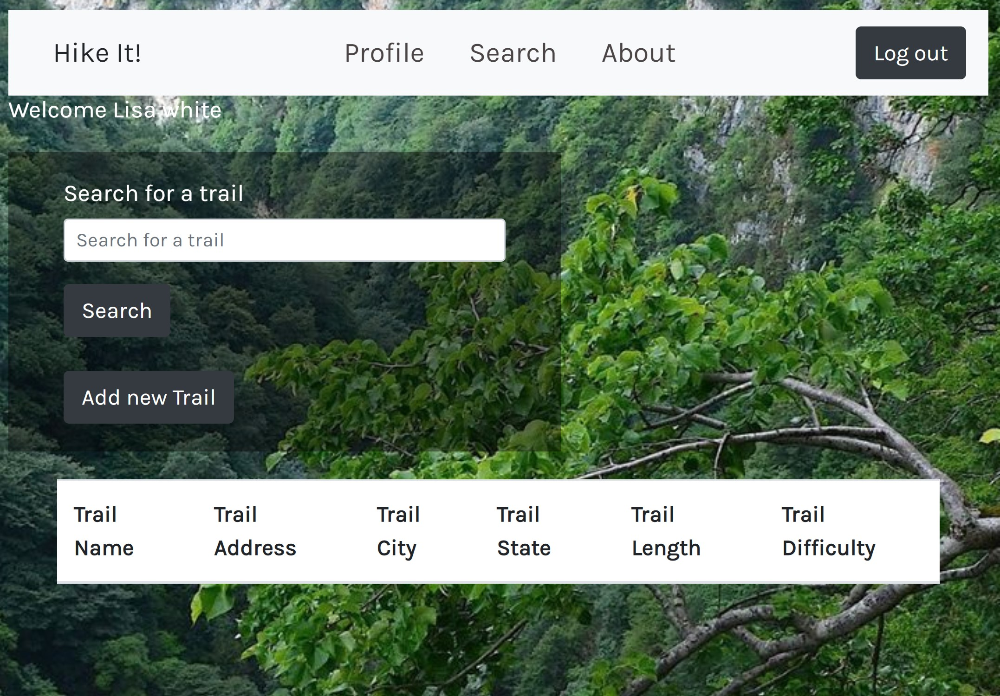
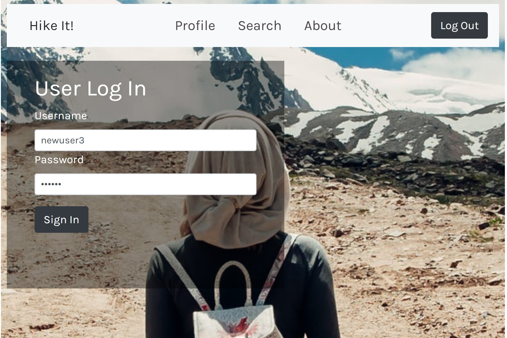
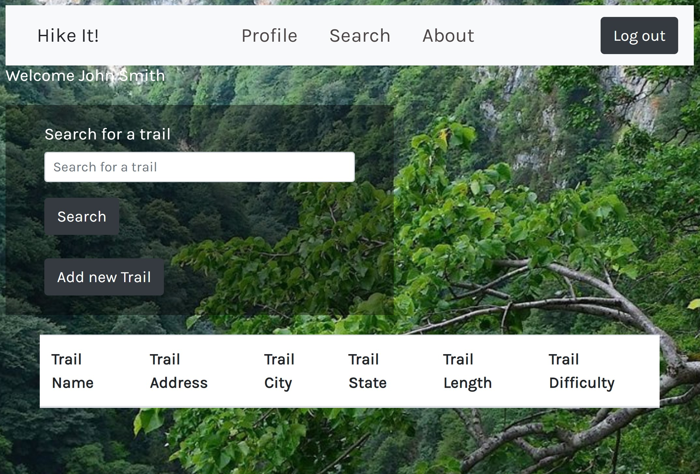
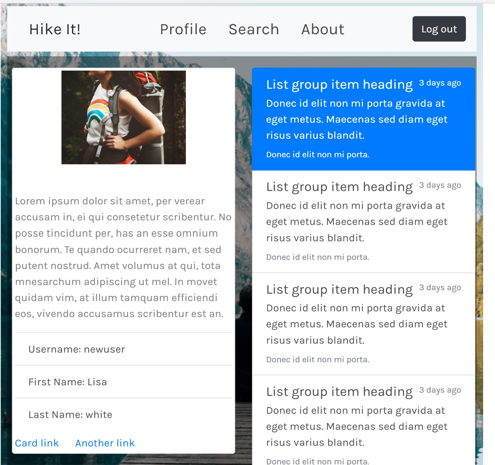
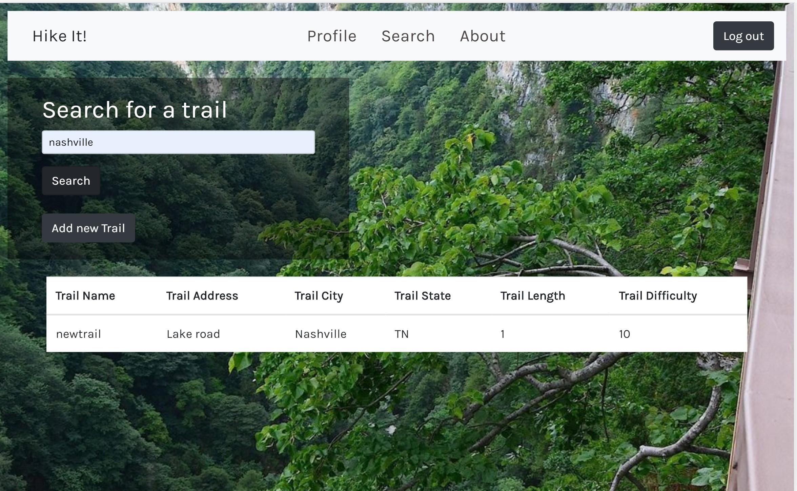

# Hike It!
A community-based application for finding hiking trails near you. 

### Overview
A hiking app integrates front-end and back-end skills as Node, Express, Handlebars,MySQL and Sequelize, following the MVC design pattern and using Node and Express and route data in the app and Handlebars to generate HTML. It includes the functions below:

* User Authetication
  Use passport's local strategy to do the signup,signin and logout functions, Use bcrypt to hash and decode the password and flash package to store the messages. 
  View the user profile information. 

* Search/Add Trail
  Search trails by city or other categories.  User can add a trail information. 


### Technologies Used
*  Front-End: 
   HTML5, CSS3, javascript, jQuery, Bootstrap
*  MiddleWare and Back-End: 
   Node.js, Express.js, MySQL, Sequelize, Handlebars
   Passport.js, Express-session, bcryptjs, connect-flash
*  Other: 
   MVC design, HeroKu/GitHub

### Check out the app!
#### GitHub Link
https://github.com/helenhao888/HikeItApp.git
#### HeroKu Live Link
https://floating-lowlands-77335.herokuapp.com/

### Contributors
##### Chris Williams
##### Helen Hao
##### Paris Cornett
##### Patricia Correia
###### Special thanks to Alec Down for numerous contributions and mentorship

### Screenshots
1. User Sign up
   Whenever a user signs up, show the sign up form, validate the input fields and create a new user. 
   
   After that navigate the page to search trail page.
   

2. User Login
   An existing user signs in, validate the input user name and password
   
   If succeeds, navigate the page to search trail page.
   

3. Profile 
   View the user's profile information if user is logged in, otherwise navigate to the home page.  
   

4. Search trails 
   Search trails by city  
   

5. Add a trail
   User adds a new trail information.
   

6. Logout
   When user clicks logout button, logout the user and navigate to home page.
   

#### Directory structure
```
.
├── config
│   ├── config.json
│   └── passport.js
│ 
├── routes
│   └── auth.js
│   └── authcontroller.js
│   └── forum-routes.js
│   └── trail-routes.js
│
├── db
│   ├── schema.sql
│   └── seeds.sql
│
├── models
│   └── forum.js
│   └── index.js
│   └── trail.js
│   └── users.js
│ 
├── node_modules
│ 
├── package.json
│
├── public
│   └── assets
│       ├── css
│       └── images
│       └── js
│
├── server.js
│
└── views   
    └── layouts
        └── main.handlebars
    ├── index.handlebars
    ├── add-trail.handlebars    
    ├── dashboard-info.handlebars
    ├── dashboard-search.handlebars   
    ├── log-in.handlebars
    └── user-profile.handlebars   
```